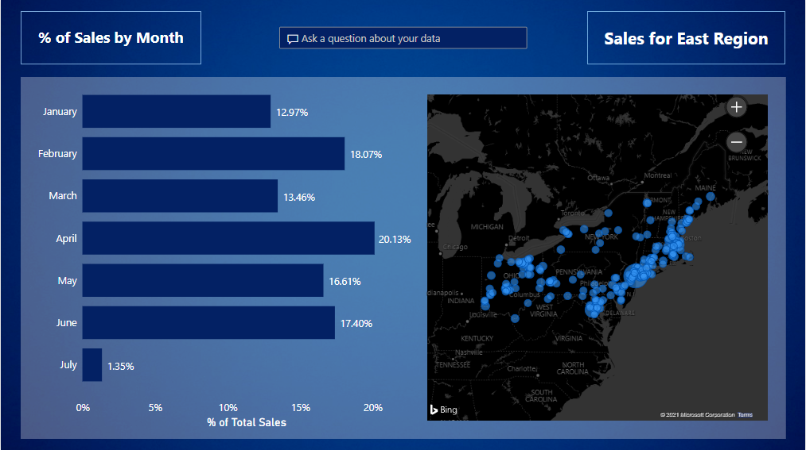

# Sales Report using Power BI

Created a report using the data (Data1.xslx) available in this Repo

## Report consists of the below findings:

#### Page 1:
- % of sales on monthly basis
- Sales for the East Region using map feature for USA
- Q & A question to allow users to explore the by asking human readable questions

#### Page 2:
- Top 5 products for each shipment in their respective regions
- Q & A question to allow users to explore the by asking human readable questions

#### Page 3:
- Top 5 profit (in %) making products sold in East region
- Average time taken between Order Date and Shipping Date for standard class of shipping for the East Region
- Q & A question to allow users to explore the by asking human readable questions
